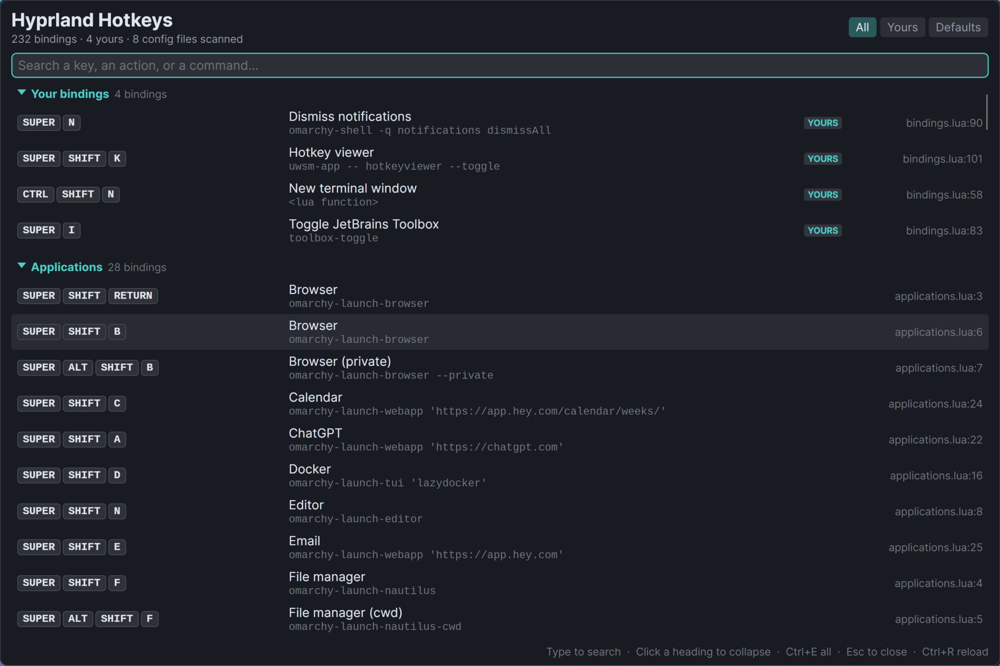
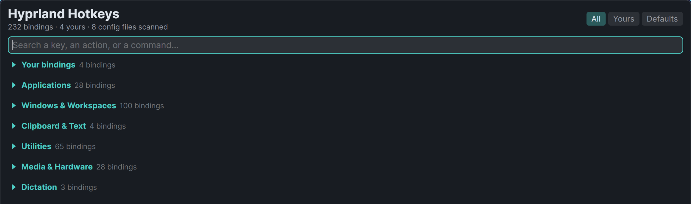
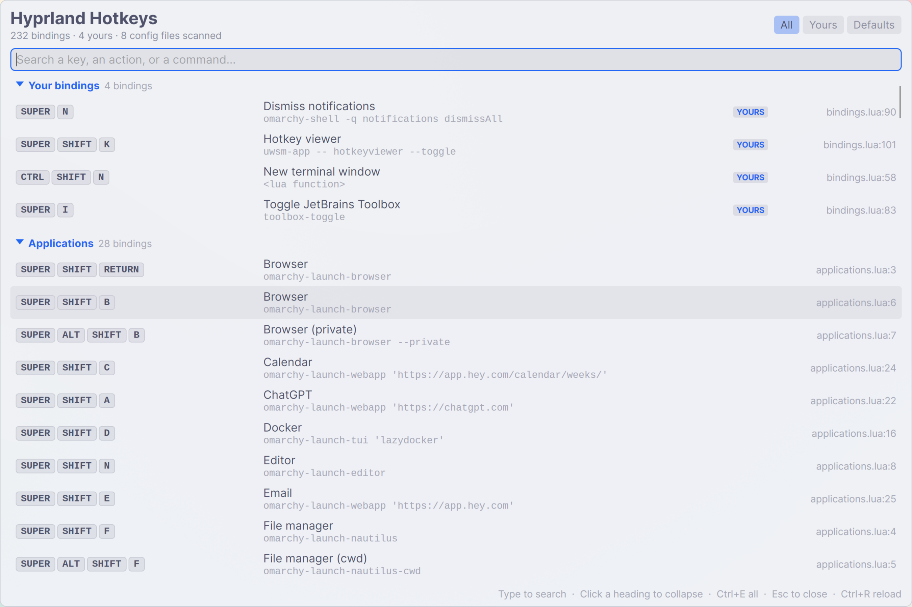

# HotKeyViewer

A .NET 10 desktop app that shows every hotkey Hyprland currently has bound —
the defaults, anything you added, and anything you remapped — in a floating,
searchable window.



Each row shows the chord as keycaps, what it does, the command it runs, and the
config file and line number it came from. Bindings you defined yourself are
tagged `YOURS`; ones that replace a default are tagged `REMAPPED`.

Click any heading to collapse that section, or `Ctrl+E` to collapse them all
into an overview:



The window follows the active Omarchy theme, including light ones — the palette,
the control chrome and the light/dark variant all come from the theme, and it
repaints live when you switch:



It ships as a self-contained native binary — no .NET on the target machine, and
173 ms from keypress to window. See [Packaging](#packaging).

## Why it reads the compositor *and* the config files

Neither source alone can answer the question.

`hyprctl binds` is authoritative about which chords are live right now, so it
naturally includes everything you added or remapped. But on a Lua-based config
(Hyprland 0.52+, which Omarchy uses) it reports **every** binding as dispatcher
`__lua` with an opaque handle number — it can tell you `SUPER+I` is bound, but
never that it runs `toolbox-toggle`, or which file put it there.

The config files hold that missing half, but they cannot simply be read as text:
a Lua config builds bindings with loops and conditionals, so a static parse both
invents bindings that a disabled branch never created and misses the ones a loop
generated.

So the app runs your config the way Hyprland does, against a stub compositor API
(`src/HotKeyViewer/Sources/scan-lua-config.lua`). Every `hl.bind` call is
recorded along with the file and line that made it, which is what makes "this
one is yours" answerable. The results are then joined onto the live bind list.

Classic `hyprland.conf` setups are supported too, on a straightforward text
walk that follows `source =` includes and expands `$variables` — a hyprlang
config is fully declarative, so reading it is safe.

## Requirements

To **run** a packaged build, nothing but Hyprland — the binary carries its own
runtime and links only `libc` and `libm`. These are used when present and simply
degrade when absent, and the footer says so:

- `lua` — for Lua-based configs, to recover commands and provenance
- `xkbcli` (from `libxkbcommon`) — to name keycode binds such as `code:10`;
  without it a small built-in table covers the common US-layout keys
- `gsettings` — to read the desktop's text-size preference; without it the app
  renders at a text scale of 1

To **build**: the .NET 10 SDK, plus `clang` for the NativeAOT build.

Tested against Hyprland 0.56.2.

## Build and run

```bash
dotnet run --project src/HotKeyViewer              # open the window
dotnet run --project src/HotKeyViewer -- --toggle  # open it, or close it if open
dotnet run --project src/HotKeyViewer -- --print   # list bindings as text
dotnet test                                        # run the test suite
```

## Packaging

A stock .NET publish of an Avalonia app is 36 files. Both packaged builds cut
that down and need no .NET installed on the target:

```bash
./packaging/build.sh                  # NativeAOT (default)
./packaging/build.sh --single-file    # one self-extracting file
./packaging/build.sh --rid linux-arm64
```

Output lands in `dist/<mode>/<rid>/` with a `.tar.gz` beside it.

| | NativeAOT | Single file |
| --- | --- | --- |
| Files | 3 | **1** |
| On disk | **35 MB** | 48 MB |
| Archive | **15 MB** | 41 MB |
| Launch to window | **173 ms** | 2223 ms |

**NativeAOT is the default, and the one to use for a keybinding.** It is a real
native executable, compiled ahead of time, so there is no runtime to start and
nothing to unpack — 173 ms to a window against 2.2 s, which is the difference
between a keypress feeling instant and feeling broken. The cost is that it is
not literally one file: `libSkiaSharp.so` and `libHarfBuzzSharp.so` are native
libraries that cannot be linked into an AOT image, so they sit beside the binary.
The launcher resolves them through `/proc/self/exe`, so a symlink from
`~/.local/bin` works fine.

**Single file** is there for when the artifact must be exactly one file. The
runtime unpacks itself to a temp directory on every launch, which is where the
two seconds go — fine for a manually launched tool, poor for a hotkey.

The AOT build also emits `hotkeyviewer.dbg`. It is larger than the binary and is
kept out of the archive, but keep it next to the build: it is what symbolicates
a stack trace if the app ever dumps core.

To install to `~/.local` and register a desktop entry:

```bash
./packaging/install.sh          # builds AOT, installs, symlinks onto PATH
MODE=single-file ./packaging/install.sh
```

## Using it

| Key | Action |
| --- | --- |
| `SUPER+SHIFT+K` | open the window, or close it if it is already open |
| any character | jump to the search box and start filtering |
| click a heading | collapse or expand that section |
| `Ctrl+E` | collapse every section, or reopen them all |
| `Esc` | clear the search, or close the window if the search is empty |
| `Ctrl+R` | re-read the compositor and the config files |

Search matches the chord, the action, the command, and the source file name, and
every term has to match — `super work` narrows to workspace bindings on SUPER.
The `All` / `Yours` / `Defaults` chips filter by who defined the binding.

Sections start expanded and remember what you collapse, including across
filtering and searching. While a search is running every section is forced open,
so a match can never hide inside a collapsed one and read as "no results".

### Bind it to a key

Lua config (`~/.config/hypr/bindings.lua`):

```lua
o.bind("SUPER + SHIFT + K", "Hotkey viewer", { launch = "hotkeyviewer --toggle" })
```

`--toggle` makes one key both open and dismiss the window: the app looks for
another copy of itself and terminates it rather than opening a second. The check
is by process, not by window — this app owns exactly one window and exits with
it, and asking the compositor would mean matching on the title, since the
Wayland backend leaves the app_id empty.

Classic config (`~/.config/hypr/hyprland.conf`):

```conf
bindd = SUPER SHIFT, K, Hotkey viewer, exec, hotkeyviewer --toggle
```

### Floating window

The app asks Hyprland to float and centre it at startup, so no configuration is
needed. The rule is registered over IPC and lasts only for the current session —
it never writes to your config. Note that on a Lua config `hyprctl keyword` is
rejected outright ("keyword can't work with non-legacy parsers"), so the rule
goes through `hyprctl eval` instead; the app tries both.

To make it permanent, add the equivalent to your own config:

```lua
-- Matches on title, because the Wayland backend leaves the app_id empty.
o.window({ title = "^Hyprland Hotkeys$" }, { float = true, center = true })
```

## On a non-Omarchy Hyprland

Everything Omarchy-specific is optional, and the app adapts rather than
degrading. On a stock Hyprland install (Arch, Fedora, Ubuntu, whatever):

- **Config** is read by the hyprlang walker, which follows `source =` includes,
  expands `$variables`, and handles `bind`/`bindd`/`bindm` and `unbind`.
- **Commands** come straight from `hyprctl binds`, which on a stock install
  reports real dispatcher names (`exec`, `movefocus`) instead of the opaque
  `__lua` a Lua config produces. So the whole thing works with **no `lua`
  installed at all** — that dependency exists only for Lua configs.
- **The float rule** falls back to `hyprctl keyword windowrule`, which is what a
  hyprlang config accepts; `hyprctl eval` is the Lua-config path.
- **Theming** falls back to the built-in dark palette when there is no Omarchy
  theme to read.
- **Text scale** falls back to 1.0 when `gsettings` is absent, and
  `HOTKEYVIEWER_TEXT_SCALE` overrides it.

Two things change shape, because a stock install has no distribution layer —
every binding is yours:

- The **Yours / Defaults** chips are hidden, since they would offer a choice
  between everything and nothing, and the status line drops its "N yours" count.
- **Grouping** falls back to what each binding does (Windows & Workspaces, Media
  & Hardware, System, Applications) instead of which file defined it, because
  filing every binding under "Your bindings" would collapse the list into a
  single group.

Optional tools, if you want the full experience:

| Distro | Package |
| --- | --- |
| Arch | `libxkbcommon` (xkbcli), `glib2` (gsettings) |
| Fedora | `libxkbcommon-tools`, `glib2` |
| Debian/Ubuntu | `libxkbcommon-tools`, `libglib2.0-bin` |

`tests/HotKeyViewer.Tests/VanillaHyprlandTests.cs` pins this behaviour by
simulating a stock install — hyprlang config, real dispatchers, no defaults
layer. It has not yet been run against a real non-Omarchy machine, so treat the
VM as the confirmation step rather than a formality.

## HiDPI and text scaling

Two separate settings decide how large this app should be, and it honours both.

**Display scale** comes from the compositor. The app runs on Avalonia's native
Wayland backend (`UseWaylandWithFallback`, with `UsePlatformDetect` supplying the
X11 fallback that must be configured first). That matters on a fractionally
scaled output: going through XWayland on a `scale = 1.6` monitor with Hyprland's
`xwayland:force_zero_scaling` means the toolkit is handed a surface it believes
is 1:1, so it lays the whole UI out at scale 1 and everything renders at roughly
⅔ of its intended size. A native Wayland surface is told the real fractional
scale, so it renders at 1.6 and stays crisp.

**Text size** is a separate user preference that the display scale says nothing
about. On a GNOME-settings desktop it is `org.gnome.desktop.interface
text-scaling-factor`, which is what Omarchy's `omarchy-display-text-size` writes
(it anchors 12px to a factor of 1.0, so a text size of 20px becomes 1.6364).
Every GTK app multiplies its fonts by it *on top of* the display scale, and
nothing in Avalonia reads it. `DisplayMetrics` reads it once at startup and
`ScaledResources` publishes the scaled font sizes the XAML binds to; the window
grows by the same factor so larger type still has room, clamped to 90% of the
screen.

Override the text scale with `HOTKEYVIEWER_TEXT_SCALE=1.0` if your desktop keeps
the setting somewhere else, or to check what it looks like unscaled.

## Theming

The window follows the active Omarchy theme and repaints when it changes — no
restart. `omarchy-theme-set` replaces the whole `~/.local/state/omarchy/current/theme`
directory and then writes `theme.name`, so the app watches that *file* in the
parent directory rather than anything inside the theme directory, which is
deleted and recreated on every switch and would silently invalidate a watch.

Only three colours are taken straight from the theme's `colors.toml` —
`background`, `foreground` and `accent` (falling back to the blue ANSI slot when
a theme sets no accent). Every other tone is mixed between the background and
the foreground, so a theme that defines only the basics still gets legible
borders, muted text and hover states, and the mixing runs in the right direction
on light themes as well as dark ones. Light themes also flip Avalonia's theme
variant, so Fluent's own scrollbars and text box do not stay dark on a pale
window. Badges reuse the palette's own green and yellow rather than fixed
colours.

With no Omarchy install the app uses its built-in dark palette.

### A caveat on window matching

Avalonia.Wayland 12.1.1 never calls `xdg_toplevel.set_app_id`, so Hyprland
reports an **empty class** for the window and no `class:` rule can match it. The
app therefore registers its float rule against both the class (which the X11
fallback does set) and the window title. The same limitation means the desktop
entry's `StartupWMClass` only takes effect under X11.

## Layout

```
src/HotKeyViewer/
  Sources/          reading the compositor and the config files
    HyprctlBindsReader.cs    parses `hyprctl binds`
    LuaConfigScanner.cs      runs a Lua config against a stub API
    scan-lua-config.lua      the stub API itself
    ConfConfigScanner.cs     walks classic .conf files
    KeycodeResolver.cs       code:10 -> the key it prints
  Services/
    HotKeyCatalog.cs         joins the live binds to their definitions
    DisplayMetrics.cs        text-scale and screen size
    ScaledResources.cs       publishes the scaled font sizes to XAML
    OmarchyTheme.cs          reads colors.toml and watches for theme switches
    ThemeResources.cs        maps the palette onto the UI's brushes
    SingleInstance.cs        the --toggle check
  ViewModels/ Views/         the window
tests/HotKeyViewer.Tests/    parser, merge and filter tests
packaging/
  build.sh                   monolithic builds (AOT / single file)
  install.sh                 build + install into ~/.local
  hotkeyviewer.desktop       desktop entry
```

## Notes

- `hyprctl binds -j` is deliberately **not** used: its JSON drops the key for
  keycode binds (reporting an empty `key` and a zero `keycode`, losing
  `SUPER + code:10` entirely) and has a history of emitting malformed JSON when
  a bind argument contains quotes. The plain-text form carries the full key.
- `--print` writes the same data as text, so it works over SSH.
- `--debug-keycodes` shows how a few raw key tokens resolve on this keyboard,
  which is the first thing to check if a chord displays oddly.
